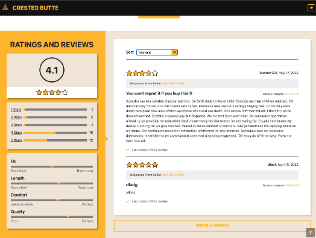

# CrestedButte - Front End Capstone

## Overview
FEC is a React single page E-Commerce application. The goal of this project is to deliver a fully functional web application that meets the business specifications and requirements outlined by project stakeholders. We worked together on a single code base by dividing up the work among team members of three and working collaboratively to produce the application, integrated the front end with the existing API for the product.

## Tech Specs
- React
- Express
- Axios
- Webpack
- Babel
- Node.js
- Jest
- Bootstrap

## Components
#### Product Overview by JP Chang

#### Main Features:
- Image Gallery
- Product Style Selector
- Size and Quantity Selector
- Add to Wish List
- Add to Cart

#### Q & A by Kyle Hatch

#### Reviews & Ratings by Peter Schaefferkoetter

Ratings and reviews on e-Commerce websites assist customers in their decision-making process to purchase a given product. Additionally, the module gives customers a way to provide feedback to the vendor and other customers. The module allows users to write, read, and browse reviews.  Features embedded within the module include
-	A sortable list of reviews that have been submitted by other users
-	A star rating system ranging from 1 (lowest) to 5 (highest) stars
-	A rating breakdown summary that gives users to ability to filter on a star rating
-	A product breakdown summary giving feedback on specific product characteristics
-	A form for users to submit reviews

